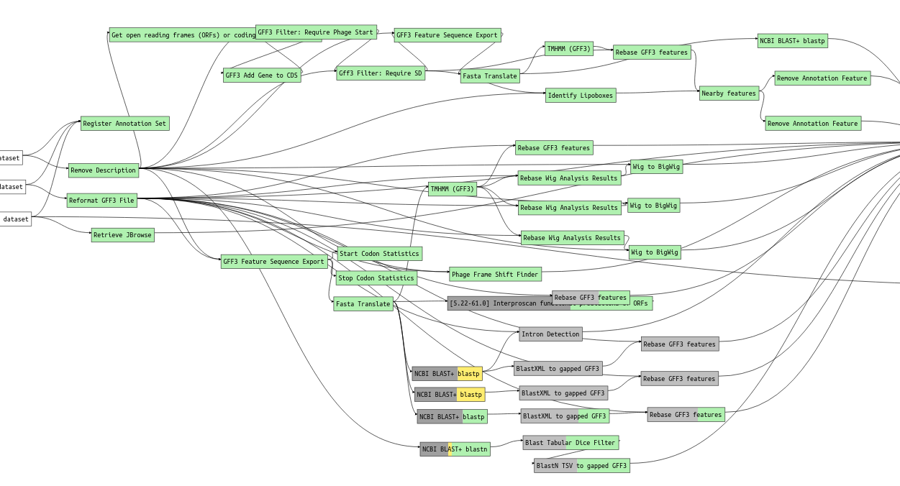

# Galaxy Workflow Status

Based on [erasche/galaxy-workflow-plotter](https://github.com/erasche/galaxy-workflow-plotter),
a tool to visualise many invocations of a single galaxy workflow.

## Screenshot



## Generating the Data

```console
python pull.py -u $GALAXY_URL -k $GALAXY_API_KEY -i $WORKFLOW_ID  > data.json
```

## License

[AGPL-3.0](http://opensource.org/licenses/AGPL-3.0)
